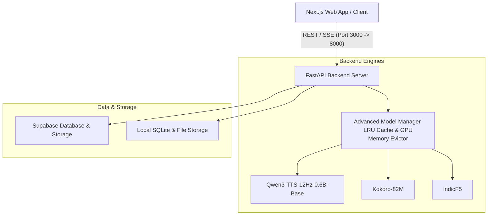
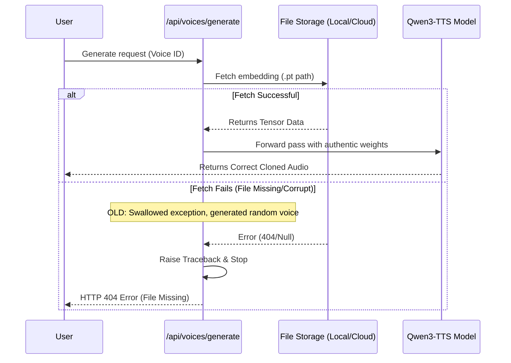

# 🦜 Auralis — Voice Intelligence Platform

Auralis is a multi-engine Voice Intelligence Platform built on a modern stack featuring **FastAPI**, **Next.js**, and state-of-the-art TTS models including **Qwen3-TTS**, **Kokoro-82M**, and **IndicF5**. It provides high-fidelity, real-time voice cloning, custom voice design, and multi-speaker dialogue synthesis.

---

## 🏗️ Architecture Overview

Auralis utilizes a decoupled client-server architecture with an advanced model management layer designed to orchestrate multiple deep learning models dynamically.



---

## ⚙️ TTS Engine Routing & Capabilities

Auralis routes generation requests dynamically based on the requested language, speed mode, and cloning requirements:

| Engine Key | Model Name | Primary Use Case | Supported Languages | VRAM Footprint |
| :--- | :--- | :--- | :--- | :--- |
| **`kokoro`** | Kokoro-82M | Ultra-lightweight, fast generation | `en`, `es`, `fr`, `hi`, `it`, `ja`, `pt`, `zh` | ~300 MB |
| **`qwen3_0_6b`** | Qwen3-TTS-12Hz-0.6B-Base | High-fidelity voice cloning (Zero-Shot ICL / X-Vector) | `en`, `zh`, `ja`, `ko` | ~1.5 GB |
| **`indic_f5`** | IndicF5 (AI4Bharat) | Specialized Indic language synthesis | `hi`, `mr`, `bn`, `gu`, `kn`, `ml`, `or`, `pa`, `ta`, `te`, `as` | ~2.0 GB |

---

## 🚀 Getting Started

### 📋 Prerequisites

| Component | Recommended Version | Purpose |
| :--- | :--- | :--- |
| **Python** | `3.10` or `3.12` | Backend & ML execution environment |
| **Node.js** | `v18+` (Tested on `20.x`) | Next.js Frontend server |
| **Nvidia CUDA GPU** | `8GB+ VRAM` | Running Qwen3 and IndicF5 locally with high throughput |
| **FFmpeg / Librosa** | System standard | Audio format loading and conversion |

---

### 🔧 Installation & Setup

1. **Clone the Repository:**
   ```bash
   git clone https://github.com/ayushcody/auralis.git
   cd cloner
   ```

2. **Backend Setup:**
   ```bash
   cd backend
   python -m venv .venv
   source .venv/bin/activate  # Or .venv\Scripts\activate on Windows
   pip install -r requirements.txt
   cd ..
   ```

3. **Frontend Setup:**
   ```bash
   cd frontend
   npm install
   cd ..
   ```

---

### 💻 Running the Services

Use the included helper scripts from the workspace root directory:

* **Start Backend Server (FastAPI):**
  ```bash
  bash start-backend.sh
  ```
  *Runs on `http://localhost:8000`*

* **Start Frontend Server (Next.js):**
  ```bash
  bash start-frontend.sh
  ```
  *Runs on `http://localhost:3000`*

* **Start Standalone Gradio UI:**
  ```bash
  bash start-gradio.sh
  ```
  *Runs on `http://localhost:7860`*

---

## 🔧 Recent Diagnostics & Code Fixes

Following a deep-dive investigation into silent voice cloning errors (where generation completed successfully but produced incorrect voices), the following robust mechanisms were implemented:



### Key Enhancements:
1. **Explicit Storage Path Logging**: We now print the exact path used during both `.pt` saving (`clone` step) and loading (`generate` step) to make it easy to spot directory/bucket path mismatches.
2. **Removed Silent Random Tensor Fallbacks**: Instead of replacing missing embeddings with `torch.randn(1, 1024)` (which generated random outputs), the backend now prints the full traceback and throws an HTTP `404` exception.
3. **Explicit Eval Mode**: The backend now calls `.eval()` on the inner PyTorch model modules immediately after loading, ensuring dropdown and normalization layers behave consistently during inference.
4. **Normalized Checkpoints**: Frontend and backend are synced to target `Qwen/Qwen3-TTS-12Hz-0.6B-Base` for consistency.

---

## 📜 License & Acknowledgments
Educational and research project leveraging the Alibaba Qwen Team's `Qwen3-TTS` and Alibaba's voice clone models.
